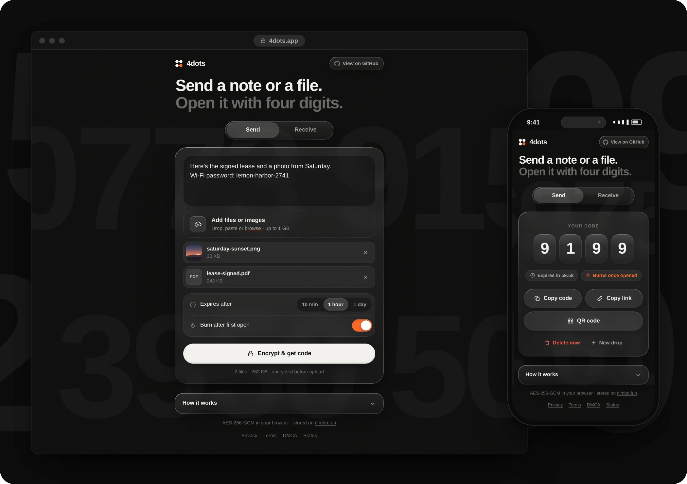
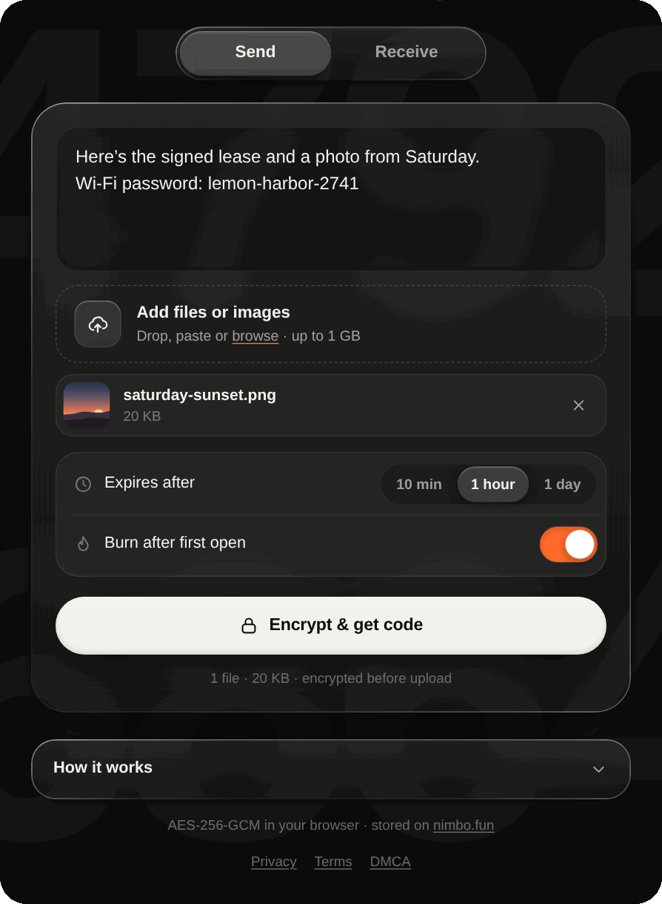
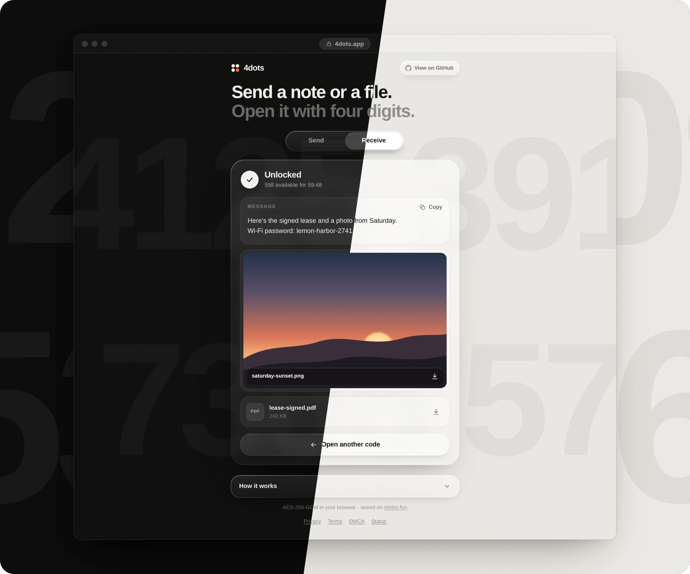
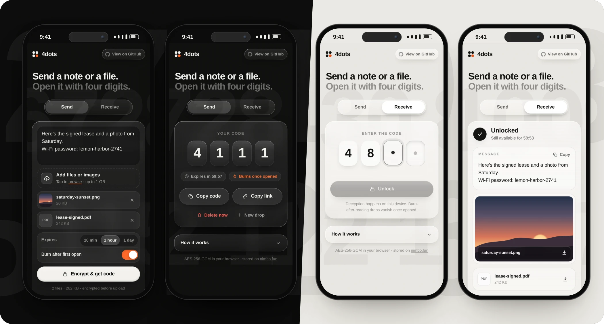
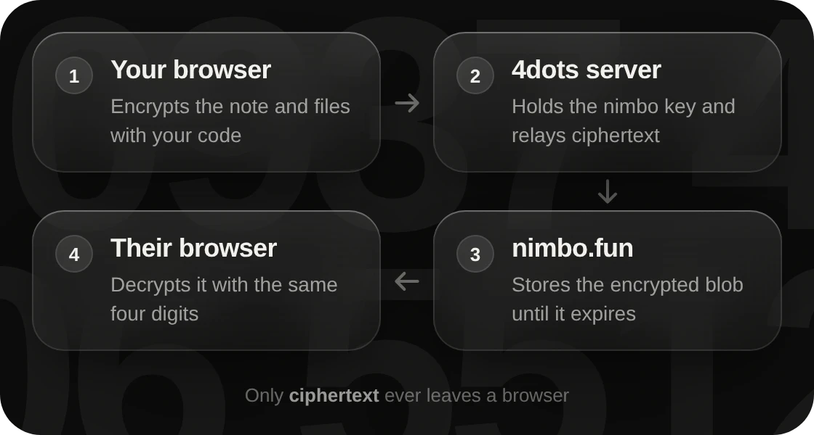

<p align="center">
  
</p>

<p align="center">
  Text, images and files up to 1&nbsp;GB, encrypted in your browser and unlocked with a four-digit code that expires on its own.
</p>

<p align="center">
  <a href="https://4dots.app"><b>Open 4dots.app</b></a>
  &nbsp;·&nbsp;
  <a href="#quick-start"><b>Quick start</b></a>
  &nbsp;·&nbsp;
  <a href="#how-it-works"><b>How it works</b></a>
  &nbsp;·&nbsp;
  <a href="#security"><b>Security</b></a>
  &nbsp;·&nbsp;
  <a href="docs/README.md"><b>Docs</b></a>
</p>

<br>

<p align="center">
  
</p>

<br>

- **Four digits, that's it.** Write a note or add files and get a code like `4821`. Say it, text it or share the link. No accounts.
- **Sealed on your device.** Everything is encrypted with AES-256-GCM before it leaves the browser. The server and storage only see ciphertext.
- **Gone when it's done.** Drops expire after 10&nbsp;minutes, an hour or a day, can burn after the first open, and can be deleted early.

<br>

## In motion

<p align="center">
  
</p>

<p align="center"><sub>Views slide through the glass with real directional motion blur, then the code rolls in like a slot machine. The giant digits drifting behind everything are random. They just give the glass something to bend.</sub></p>

<br>

## Light and dark

<p align="center">
  
</p>

<p align="center"><sub>Follows your system theme: warm black or paper, with one orange accent.</sub></p>

<br>

## On your phone

<p align="center">
  
</p>

<p align="center"><sub>The whole form fits on one screen. Typing digits anywhere jumps straight into the code.</sub></p>

<br>

## How it works

<p align="center">
  
</p>

1. **You get a code.** The server reserves a free four-digit code and hands your browser a one-time upload token.
2. **Your browser seals it.** The note and files are bundled and encrypted in 4&nbsp;MB chunks, with a key derived from the code (PBKDF2, 600k rounds) plus a per-code secret from the server.
3. **The ciphertext is stored.** It goes up in parts of up to 90&nbsp;MB, which the server streams to [nimbo.fun](https://nimbo.fun) under random names. Your nimbo API key never reaches a browser.
4. **They open it.** Their browser downloads the ciphertext and decrypts it as it arrives. Burn-after-reading drops are deleted the moment they're delivered.

<br>

## Quick start

You need **Node 20+**.

```sh
git clone https://github.com/4dotsapp/4dots.git
cd 4dots
npm install
npm run dev        # localhost:8787, against a mock of the nimbo API
```

`npm run dev` never touches real storage, so you can play with it straight away.

### Run your own

4dots fits on the **Cloudflare Workers free plan**. You need a [nimbo.fun API key](https://nimbo.fun/profile) for storage.

```sh
npx wrangler login
npx wrangler secret put NIMBO_TOKEN   # paste your nimbo API key
npm run deploy
```

Then add your domain under the Worker's **Settings → Domains & Routes**, or set `workers_dev` to `true` in `wrangler.jsonc` for a free `workers.dev` address. Configuration and the API are in the **[docs](docs/README.md)**.

<br>

## Security

> [!IMPORTANT]
> A four-digit code is quick to share and also quick to guess: there are only 10,000 of them. 4dots is built for things that matter for minutes, not secrets that must stay secret forever.

- **Storage can't read your drops.** nimbo.fun sees ciphertext under random names. It never learns the codes or the per-code secrets, so it can't brute-force them either.
- **Guessing is slowed down.** Drops expire, can burn after one open, and each IP gets 12 wrong codes per 10 minutes.
- **Tampering fails loudly.** Every chunk is authenticated and numbered, so a reordered, cut-short or altered drop won't decrypt.
- **The ceiling is honest.** Whoever runs the server holds the secret that makes the keys, and with 10,000 codes they could work them out. No four-digit design can avoid that.

<br>

## Under the hood

- **Frontend:** plain HTML, CSS and JavaScript modules. No framework, no build step.
- **Glass:** `backdrop-filter` with rim lighting and a pointer-following sheen. In Chromium, an SVG displacement map bends the backdrop at the edges like a glass rod.
- **Motion:** animation-frame tweens that blur each moving element along its direction of travel, in proportion to its speed. Devices that can't hold about 40 fps get a lighter mode automatically.
- **Crypto:** Web Crypto, with AES-256-GCM in 4&nbsp;MB chunks and PBKDF2-SHA256 keys.
- **Server:** a Cloudflare Worker that streams every byte straight through, plus one Durable Object that remembers codes, expiry, burns and rate limits.
- **Storage:** the [nimbo.fun](https://nimbo.fun/docs) REST API.

<br>

## Contributing

Issues and pull requests are welcome. Found a security problem? Please report it privately, as described in [SECURITY.md](SECURITY.md).

<br>

<p align="center">
  <sub><a href="https://4dots.app">4dots.app</a> · <a href="LICENSE">MIT licensed</a> · Storage by <a href="https://nimbo.fun">nimbo.fun</a></sub>
</p>
