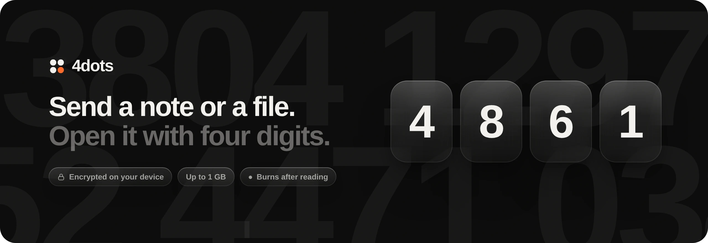

<p align="center">
  
</p>

<p align="center">
  Share text, images and files up to 1&nbsp;GB with a four-digit code.<br>
  Encrypted in the browser, served by Cloudflare Workers, stored on <a href="https://nimbo.fun/docs">nimbo.fun</a>.
  <br><br>
  <a href="https://4dots.app"><b>4dots.app</b></a>
  &nbsp;·&nbsp;
  <a href="../README.md"><b>Overview</b></a>
  &nbsp;·&nbsp;
  <a href="#run-it"><b>Run it</b></a>
  &nbsp;·&nbsp;
  <a href="#deploy"><b>Deploy</b></a>
  &nbsp;·&nbsp;
  <a href="#api"><b>API</b></a>
</p>

<br>

## Run it

Requires **Node 20+**.

```sh
npm install
npm run dev        # → http://localhost:8787
```

`npm run dev` starts the Worker with `wrangler dev` against an in-memory mock of the nimbo API (`dev/mock-nimbo.mjs`), so nothing touches real storage. Extra flags go to wrangler, for example `npm run dev -- --port 3000 --var PART_MB:5`.

To try it against real nimbo storage, copy `.dev.vars.example` to `.dev.vars` (it's git-ignored), add your key and run `npx wrangler dev`.

<br>

## Deploy

4dots runs on the **Cloudflare Workers free plan**: the Worker, its static files and one SQLite-backed Durable Object.

**From your machine**

```sh
npx wrangler login
npx wrangler secret put NIMBO_TOKEN   # paste your nimbo API key
npm run deploy
```

**From GitHub, no terminal.** Go to **Workers & Pages → Create → Import a repository**, then:

1. Pick the repository. Leave the build command empty; the deploy command is `npx wrangler deploy`.
2. After the first deploy, add `NIMBO_TOKEN` as a **Secret** under the Worker's **Settings → Variables and Secrets**.

Every push to the main branch then deploys again.

**Your own domain.** Once the domain's zone is active on Cloudflare, open the Worker's **Settings → Domains & Routes → Add → Custom domain** and enter it (for example `4dots.app`). Cloudflare creates the DNS record and the certificate.

`wrangler.jsonc` turns off the `workers.dev` and preview addresses, so the Worker answers only on its custom domain. Set `workers_dev` to `true` if you'd rather use a free `workers.dev` address.

<br>

## API

The nimbo key can list, overwrite and delete everything in your storage, so it never ships to browsers. The Worker keeps it and exposes only these endpoints:

| Endpoint | Purpose |
| --- | --- |
| `GET /api/config` | Size limit, part size and allowed expiry times |
| `POST /api/drops` | Reserve a free code. Returns a reservation token, the code's pepper and the part size |
| `PUT /api/drops/:code/parts/:n` | Upload one part of the ciphertext (`x-reservation` header), streamed to nimbo |
| `POST /api/drops/:code/commit` | Finish the upload: `{ ttl, burn, parts }`. Returns the expiry and a revoke token |
| `GET /api/drops/:code` | Stream the whole ciphertext back. Burn-after-reading drops are deleted after delivery |
| `DELETE /api/drops/:code` | The sender deletes early with the revoke token (`x-revoke-token`) |

Workers accept at most 100&nbsp;MB per request, so the browser uploads in parts (90&nbsp;MiB by default). Each part becomes its own nimbo file, and downloads stream the parts back to back as a single response.

<br>

## Security model

- **Browser:** AES-256-GCM, with a key from PBKDF2-SHA256 (600k rounds) over the code plus a per-code pepper. Plaintext and file names never leave the device. Data is sealed in 4&nbsp;MiB chunks, each nonce carrying the chunk number and a last-chunk flag, so reordered, dropped or truncated chunks fail to decrypt.
- **nimbo.fun:** sees only ciphertext under random names. It learns neither the codes nor the peppers, so it can't brute-force the content.
- **The Worker** (you) holds the secret behind the peppers. Because a code is only 10,000 possibilities, whoever runs the Worker could derive keys. That is the ceiling for any four-digit design, and why this suits short-lived sharing rather than long-term secrets.
- **Guessing** is held back by short expiry, optional burn-after-reading, and a limit of 12 wrong codes per IP per 10 minutes.
- **Headers:** a strict Content-Security-Policy and friends are set in `public/_headers`.

<br>

## Configuration

Set variables in `wrangler.jsonc` under `vars`, and secrets with `wrangler secret put`.

| Name | Default | |
| --- | --- | --- |
| `NIMBO_TOKEN` | required, **secret** | nimbo.fun API key |
| `DROP_SECRET` | derived from the key | Optional **secret**. Changing it (or the key) makes live drops undecryptable |
| `MAX_UPLOAD_MB` | `1024` | Per-drop size limit (your nimbo plan's quota still applies) |
| `PART_MB` | `90` | Upload part size. Keep it under the 100&nbsp;MB Workers request limit |
| `NIMBO_FOLDER` | `drop` | Folder inside your nimbo storage that holds drops |
| `NIMBO_BASE_URL` | `https://nimbo.fun` | |

The Durable Object's alarm expires drops and abandoned uploads on time and deletes their files from nimbo, a few dozen at a time.

<br>

## Brand

Icons live in [`docs/brand`](brand): the app icon with and without rounded corners, the four-dot mark for dark and light backgrounds (transparent), and a `favicon.ico`. The site's own favicons, link preview image (`og.png`, 1200×630) and web app manifest are in `public/`.

<br>

## Project layout

```
4dots/
├── wrangler.jsonc      Worker config: static assets, Durable Object, variables
├── worker/
│   ├── index.js        the /api routes: parts upload, commit, streaming download
│   ├── registry.js     Durable Object: codes, expiry, burns, rate limits, deletions
│   ├── nimbo.js        streaming client for the nimbo.fun API
│   └── http.js         errors and JSON responses
├── public/
│   ├── index.html      the whole UI
│   ├── styles.css      liquid glass, themes, layout
│   ├── app.js          views, transitions, sending and receiving
│   ├── crypto.js       chunked AES-GCM seal / unseal
│   ├── motion.js       tweens and speed-based motion blur
│   ├── slider.js       press-and-drag liquid pill for the segmented controls
│   ├── lens.js         edge refraction for Chromium
│   ├── 404.html        page for unknown paths
│   ├── robots.txt      crawler rules, sitemap.xml, and llms.txt for AI search
│   └── _headers        security headers for the static files
├── dev/                mock nimbo API and `npm run dev`
└── docs/               README images and brand icons
```
